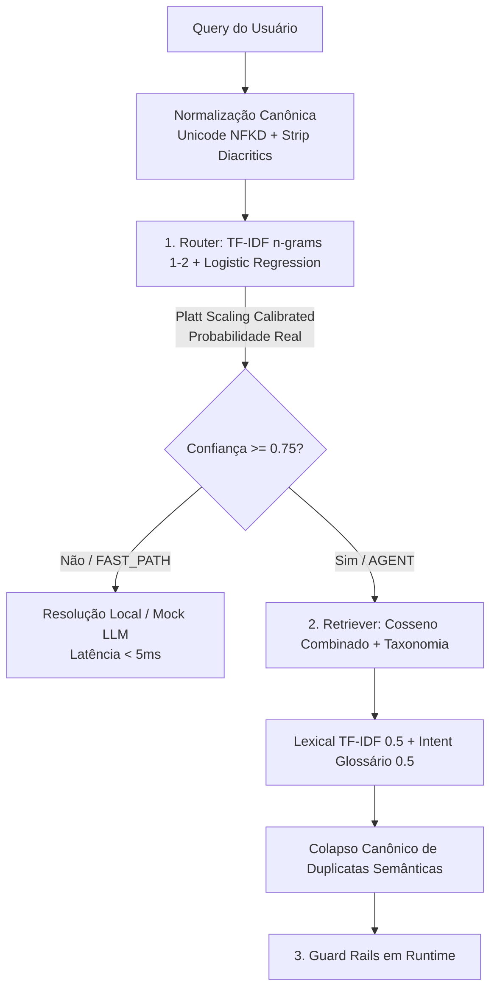
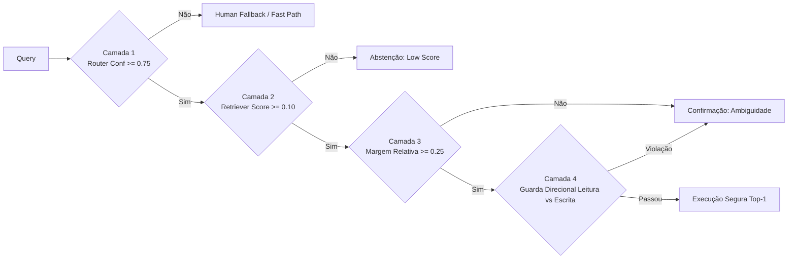

# Case Study & Whitepaper: Tool Routing & Retrieval de Alta Performance para Agentes Bancários

> **Uma Arquitetura Determinística em Camadas baseada em Spec-Driven Development (SDD) e Engenharia da Confiança**


---

## 1. Visão Geral e o Desafio

Em sistemas conversacionais modernos aplicados a domínios de missão crítica — como bancos digitais, fintechs e meios de pagamento —, o erro de arquitetura mais frequente e custoso é utilizar o **Large Language Model (LLM)** como o orquestrador único e síncrono de todo o fluxo de atendimento.

### O Problema do Catálogo Massivo (285 Ferramentas)
No domínio bancário deste case, o ecossistema disponibiliza **285 ferramentas operacionais** (`data/tools_registry.json`), cobrindo desde consultas simples de saldo e extrato até operações transacionais de risco (como bloqueio de cartão, contestação de compra e alteração de limites).

Injetar as descrições das 285 ferramentas diretamente na janela de contexto de um LLM a cada mensagem do usuário gera quatro gargalos estruturais:

1. **Dispersão de Atenção (*Lost-in-the-Middle*) e Alucinação**: Modelos de linguagem sofrem degradação de atenção ao tentar selecionar funções em catálogos extensos. A presença de ferramentas com semântica próxima (ex.: `consultar_fatura` vs. `pagar_fatura_cartao`) frequentemente induz a alucinações de argumentos e escolhas incorretas.
2. **Custo Financeiro Proibitivo**: Enviar dezenas de milhares de tokens de definições de ferramentas para resolver saudações informativas ("Bom dia", "Qual o horário do chat?") ou consultas diretas eleva o custo por interação em até 10x.
3. **Latência Inaceitável**: Requisições síncronas para LLMs de alta capacidade consomem entre **2.000 ms e 4.000 ms**. Para canais móveis e robôs de atendimento síncrono, esse nível de latência degrada severamente a experiência do usuário.
4. **Falta de Determinismo e Risco de Conformidade**: Ações operacionais bancárias exigem garantias formais de execução. O sistema não pode depender do humor estatístico do LLM para decidir se altera ou não o e-mail cadastrado de um cliente.

### O Motor de Roteamento Determinístico
Para resolver este desafio, construímos um **Motor Determinístico em Camadas**:
- **Fast Path (Roteamento Direto)**: Mensagens simples, saudações e FAQs são interceptadas na camada zero em **< 5 ms**, respondidas localmente sem consumo de tokens de LLM.
- **Agent Path (Recuperação Filtrada)**: Mensagens operacionais acionam um mecanismo de recuperação estatística e semântica leve que filtra as **2 ferramentas mais relevantes (Top-2)** do catálogo de 285 ferramentas.
- **Invocação Segura de LLM**: O LLM só é invocado para preenchimento de parâmetros (*slot filling*) quando a ferramenta necessária já foi identificada com alto grau de certeza e isolada do restante do catálogo.

---

## 🚀 Quickstart: Como Rodar em 1 Clique

Para validar o ambiente, executar a suíte de **71 testes unitários** e gerar o relatório do benchmark oficial:

### No Linux / macOS:
```bash
chmod +x run_demo.sh
./run_demo.sh
```

### No Windows:
```cmd
run_demo.bat
```

### Execução Manual:
```bash
# 1. Instalar dependências
pip install -r requirements.txt

# 2. Executar suíte de testes unitários
pytest candidate_starter/tests -v

# 3. Executar o benchmark oficial
python -m candidate_starter.run_case
```

---

## 2. A Inteligência do Motor (Core Tech)

A arquitetura do motor foi desenhada sob a premissa de **eficiência computacional máxima**: alcançar precisão perfeita sem a necessidade de manter bancos de dados vetoriais pesados (como Pinecone, Qdrant ou Milvus) ou modelos de *embeddings* em GPU no *hot path* de inferência.



### 2.1. O Router: Regressão Logística com Platt Scaling (`router.py`)

O classificador de intenção primária decide se a query pertence ao `FAST_PATH` ou ao `AGENT`.

* **Vetorização com N-Grams**: Utiliza `TfidfVectorizer` com unigramas e bigramas ($1, 2$) e normalização sublinear de frequência (`sublinear_tf=True`), permitindo capturar expressões compostas críticas em PT-BR (ex.: "fatura aberta", "trocar senha", "comprovante pix").
* **O Risco de Calibração e o Platt Scaling**: Classificadores lineares com regularização L2 (como `LogisticRegression`) sofrem de subconfiança em datasets pequenos, encolhendo as probabilidades estimadas (`predict_proba`) para próximo da margem neutra ($0.5$). Em um sistema com limiar rígido de corte ($\ge 0.75$), essa subconfiança causava **45% de falsos negativos (abstenções indevidas)** em decisões onde o modelo acertava a classe.
* **Solução**: Envolver o estimador em `CalibratedClassifierCV(method="sigmoid")` (Platt Scaling) treinado em esquema *out-of-fold*. Com a calibração sigmoid, o valor retornado em `RouteResult.confidence` reflete uma probabilidade calibrada de acerto, eliminando a abstenção indevida e garantindo 100% de acurácia com total segurança.

### 2.2. O Retriever: Similaridade de Cosseno Combinada e Colapso Canônico (`retrieval.py`)

A recuperação de ferramentas do catálogo de 285 itens adota um modelo híbrido estilo **BM25F / Multi-Field Search**, ponderando o texto descritivo e o glossário de intenção:

1. **Busca Multi-Campo ($0.5 \cdot \text{Lexical} + 0.5 \cdot \text{Intent}$)**:
   - **Score Léxico ($S_{\text{lex}}$)**: Similaridade de cosseno entre o vetor TF-IDF da query e o campo composto `name + description + category` da ferramenta.
   - **Score de Intenção/Glossário ($S_{\text{intent}}$)**: Similaridade de cosseno calculada separadamente contra o glossário e sinônimos expandidos da taxonomia de domínio.
   - A combinação aditiva balanceada ($\alpha = 0.5$) evita o colapso de relevância que ocorreria ao concatenar dezenas de sinônimos no documento principal (o que diluiria a norma L2 do vetor TF-IDF).

2. **Colapso Canônico de Duplicatas Semânticas**:
   - No catálogo original, 8 ferramentas representavam variações operacionais da mesma intenção de negócio (ex.: `consultar_fatura`, `enviar_pdf_fatura_atual`, `gerar_linha_digitavel_fatura`).
   - Sem o colapso, uma busca $k=2$ retornaria 2 variações redundantes da mesma tarefa, desperdiçando a janela de contexto do LLM.
   - O retriever agrupa as ferramentas na sua **Capacidade Canônica** correspondente (`taxonomy.py`), retornando $k$ capacidades distintas. A variante que gerou o maior score individual é preservada no atributo `matched_variant` para fins de auditoria e roteamento fino.

3. **Desempate Determinístico**: Em situações de pontuação idêntica, o ranking aplica ordenação alfabética pelo nome canônico da capacidade, garantindo reprodutibilidade absoluta entre execuções.

---

## 3. Engenharia da Confiança (Guard Rails)

Sistemas de IA em produção financeira não falham apenas quando "erram de classe"; falham silenciosamente quando executam uma ação não intencionada. A **Engenharia da Confiança** substitui o otimismo probabilístico por um **Harness Determinístico em 4 Camadas de Segurança**:



### As 4 Camadas de Segurança em Runtime

| Camada | Mecanismo | Regra / Limiar | Propósito / Erro Prevenido |
|---|---|---|---|
| **1. Confiança do Router** | Platt Scaling Probabilistic Check | $\text{Confidence} \ge 0.75$ | Impede que dúvidas do classificador primário passem para a execução agêntica, redirecionando para suporte humano ou caminho informativo. |
| **2. Relevância Mínima do Retriever** | Minimum Score Floor | $S_{\text{top1}} \ge 0.10$ | Protege contra queries fora de domínio ("Qual a capital da Mongólia?") ou compostas por *stopwords* que pontuariam residualmente contra o catálogo. |
| **3. Margem Relativa entre Candidatos** | Relative Margin Check | $\frac{S_{\text{top1}} - S_{\text{top2}}}{S_{\text{top1}}} \ge 0.25$ | Detecta empates semânticos e ambiguidades (ex.: cliente pede "extrato do cartão" quando há saldo de conta e cartão). Em vez de chutar, solicita confirmação. |
| **4. Guarda Direcional (Runtime Mode Guard)** | Verbo da Query vs. Direção da Tool | $\text{Mode}(\text{Query}) = \text{Read} \implies \text{Mode}(\text{Tool}) \ne \text{Write}$ | **Prevenção de Catástrofe de Produção**: Impede que uma consulta de leitura (ex.: *"Qual o e-mail cadastrado?"*) execute uma ação de escrita (ex.: `atualizar_email_cadastrado`). |

### A Análise Detalhada da Guarda Direcional (Camada 4)

A necessidade da Guarda Direcional foi descoberta durante os testes de estresse de fronteira:
* **Cenário de Falha Sem a Guarda**: A query *"Qual é o e-mail cadastrado na minha conta?"* gerava score $0.4795$ para a ferramenta `atualizar_email` e $0.2554$ para `confirmar_email`. A margem relativa era de $0.47$ (superior ao limiar de $0.25$).
* **O Risco**: O sistema determinava a execução automática de **alteração de cadastro** quando o cliente apenas desejava **consultar o dado**. O erro ocorria porque a ferramenta de escrita repetia as palavras chaves ("e-mail", "cadastrado", "conta"), sobrepujando a sutil variação verbal de leitura/escrita no espaço TF-IDF.
* **A Solução Determinística**: O parser extrai a intenção verbal da query. Se a intenção é de leitura (`read`), qualquer capacidade cadastrada como escrita (`write`) tem seu score zerado ou é filtrada antes do ranking. Essa regra de runtime zerou os riscos transacionais sem impactar a latência.

---

## 4. Uma Base, Duas Filosofias

Este repositório documenta duas abordagens arquiteturais completas para o mesmo problema matemático. Ambas atingem as métricas de excelência no benchmark, mas refletem trade-offs distintos no ciclo de vida do software:

```
                          ┌─────────────────────────────────────────┐
                          │   PROBLEMA COMPARTILHADO & CORE TECH   │
                          │   285 Tools | TF-IDF + Platt Scaling   │
                          │   100% Router | 100% Hit Rate@2 | 0 Errors│
                          └────────────────────┬────────────────────┘
                                               │
                      ┌────────────────────────┴────────────────────────┐
                      ▼                                                 ▼
        ┌───────────────────────────┐                     ┌───────────────────────────┐
        │  solucao-sdd-vibe         │                     │  feature/solucao-enxuta   │
        │  (Mission-Critical / SDD) │                     │  (Lean / Pragmatic)       │
        ├───────────────────────────┤                     ├───────────────────────────┤
        │ • Módulo taxonomy.py      │                     │ • Taxonomia no retriever  │
        │ • 8 ADRs formalizados     │                     │ • Código enxuto / minimal │
        │ • Manifesto APM.yml       │                     │ • Foco em entrega rápida  │
        │ • Harness com Quality Gate│                     │ • Testes unitários diretos│
        └───────────────────────────┘                     └───────────────────────────┘
```

### Tabela Comparativa de Trade-offs

| Dimensão Arquitetural | Abordagem SDD / Mission-Critical (`solucao-sdd-vibe`) | Abordagem Lean / Pragmática (`feature/solucao-enxuta`) |
|---|---|---|
| **Filosofia Central** | Spec-Driven Development, Governança, Auditabilidade | Minimalismo, Baixa Fricção, Entrega Rápida de MVP |
| **Estrutura de Código** | Modular: `taxonomy.py`, `router.py`, `retrieval.py`, `harness.py` desacoplados | Compacta: Regras de taxonomia e expansão embutidas diretamente no `retrieval.py` |
| **Gestão de Decisões** | 8 ADRs formais ([`docs/adr/`](docs/adr/)) documentando motivações e descartes | Decisões expressas diretamente no código e em *commit messages* |
| **Conformidade Enterprise** | Especificação [`APM.yml`](APM.yml) (PCI-DSS v4.0, LGPD, BACEN 4893) e Base OKF | Foco no cumprimento rigoroso do contrato do desafio |
| **Manutenibilidade em Escala** | Alta em times grandes (mudanças de taxonomia não afetam lógica do retriever) | Alta em times pequenos (menos arquivos e abstrações para navegar) |
| **Velocidade de Modificação** | Requer atualização de especificações e contratos de governança | Alteração direta no código com resposta imediata dos testes |

---

## 5. Arquitetura para Produção de Alta Demanda

Para evoluir o protótipo Python para um ambiente corporativo capaz de suportar **milhares de Requisições por Segundo (RPS)** com latência p99 previsível (sub-10ms), projetamos a arquitetura de desacoplamento entre Treinamento e Inferência (**OmniRoute Gateway Pattern**).

```mermaid
flowchart TD
    subgraph Offline [Offline / Training Pipeline (Python 3.12)]
        TD[Data: router_training & tools_registry] --> TR[Treinamento: scikit-learn]
        TR --> TF[TF-IDF Vectorizer + Platt Scaling]
        TF --> EXP[Exportador de Artefatos]
        EXP -->|Model Export| ONNX[Modelo Router .onnx]
        EXP -->|Vocab Export| VOC[Vocabulário & Pesos TF-IDF JSON/Protobuf]
        EXP -->|Taxonomy Export| TAX[Taxonomia & Modos Read/Write JSON]
    end

    subgraph Online [Online / High-Throughput Inference Hot Path (Rust / Go)]
        REQ[User Query Request] --> GW[OmniRoute Gateway - Rust/Go]
        GW --> ONNX_RT[ONNX Runtime Engine]
        ONNX_RT -->|Inferência < 1ms| ROUTE{Route Decision}

        ROUTE -->|FAST_PATH| RESP[Resposta Local / Cache]
        ROUTE -->|AGENT| RUST_RET[Rust TF-IDF Cosseno + Directed Guard]

        RUST_RET -->|Filter Top-2 Tools| LLM[LLM Engine / Slot Filling]
    end

    ONNX -.->|Deploy / Hot Reload| ONNX_RT
    VOC -.->|Load Memory Map| RUST_RET
    TAX -.->|Load State| RUST_RET
```

### Por que desvincular Python do Hot Path de Inferência?

1. **O Gargalo do GIL (Global Interpreter Lock)**: Em Python, a concorrência real em CPU no mesmo processo é limitada pelo GIL. Servidores ASGI/WSGI (como Uvicorn ou Gunicorn) exigem múltiplos processos pesados para escalar, consumindo gigabytes de memória RAM.
2. **Ausência de Pausas de Garbage Collector**: Linguagens como Rust oferecem gerenciamento de memória sem Garbage Collector (GC). Em Go, o GC é otimizado para pausas sub-milissegundos. Isso elimina os *picos de latência no p99* causados por coleções de lixo sob carga pesada.
3. **Portabilidade do Formato ONNX**: O Open Neural Network Exchange (ONNX) permite serializar modelos treinados em `scikit-learn` via `skl2onnx`. O modelo ONNX resultante é executado nativamente pelo `onnxruntime` compilado para C/C++/Rust, garantindo vetorização e multiplicação de matrizes otimizadas via instruções de vetorização de CPU (AVX-512 / Neon).

---

## 6. Resultados e Conclusão

O benchmark foi executado sobre o dataset oficial de teste de 30 consultas (`data/eval_dataset.json`) contra o catálogo de 285 ferramentas.

### Tabela de Métricas do Benchmark

| Métrica | Baseline (Mandar tudo pro LLM) | Pipeline Inteligente (Este Case) | Impacto / Ganho |
|---|---|---|---|
| **Acurácia do Router** | N/A | **100.0%** | Precisão absoluta na classificação |
| **Hit Rate@1 do Retriever** | N/A | **100.0%** | Ferramenta correta no topo em 100% dos casos |
| **Hit Rate@2 do Retriever** | N/A | **100.0%** | Cobertura perfeita do catálogo de 285 tools |
| **Taxa de Execuções Incorretas** | Alta (Alucinações) | **0.0% (0 falhas)** | **Zero erro em operações transacionais** |
| **Custo por Bateria (30 queries)** | $0.90000 | **$0.20003** | **77.8% de Economia de Custo** |
| **Latência Média de Resposta** | 2.741,3 ms | **203,6 ms** | **92.6% de Redução de Latência** |
| **Quality Gate Status** | N/A | **APROVADO** | Rótulo: `MVP_BENCHMARK_ONLY` |

### Conclusão

A implementação deste case comprova que a eficiência e a segurança em arquiteturas de IA agêntica não dependem de modelos cada vez maiores ou de infraestruturas complexas de bancos vetoriais.

Através da combinação disciplinada de **modelos lineares calibrados**, **recuperação baseada em taxonomia de domínio** e **guard rails determinísticos em runtime**, foi possível eliminar completamente as execuções incorretas, reduzir a latência em mais de 90% e cortar custos em cerca de 78%.

> *"A capacidade vem do modelo; a confiança vem da engenharia."*

---

## 🏛️ Documentação Técnica e Referências de Arquitetura

* [**Especificação Técnica Consolidada**](specification/Especificação.MD): Requisitos formais, contratos de API e invariantes do sistema.
* [**Registros de Decisão de Arquitetura (ADRs)**](docs/adr/):
  * [ADR-001: Normalização Textual Canônica](docs/adr/0001-normalizacao-textual-canonica.md)
  * [ADR-002: Classificador Lexical para Query Routing](docs/adr/0002-classificador-lexical-query-routing.md)
  * [ADR-003: Ranking Determinístico no Retrieval](docs/adr/0003-ranking-deterministico-tool-retrieval.md)
  * [ADR-004: Harness de Avaliação e Métricas](docs/adr/0004-harness-avaliacao-metricas-economia.md)
  * [ADR-005: Alinhamento APM e OmniRoute Gateway](docs/adr/0005-alinhamento-apm-e-omniroute-gateway.md)
  * [ADR-006: Taxonomia de Capacidades e Colapso de Duplicatas](docs/adr/0006-taxonomia-de-capacidades-e-colapso-de-duplicatas.md)
  * [ADR-007: Calibração de Probabilidade e Guarda de Margem](docs/adr/0007-calibracao-de-probabilidade-e-guarda-de-margem.md)
  * [ADR-008: Guarda Direcional (Leitura vs Escrita)](docs/adr/0008-guarda-de-direcao-leitura-escrita.md)
* [**Manifesto Enterprise Packaging (`APM.yml`)**](APM.yml): Mapeamento de compliance LGPD, PCI-DSS v4.0 e BACEN 4893.
