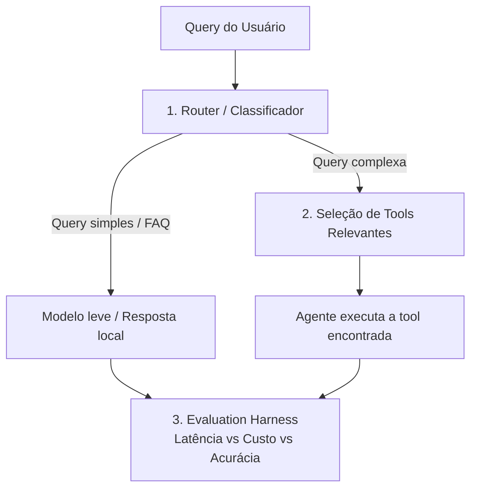
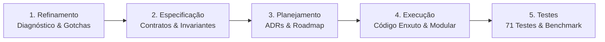

# Case Técnico — Router de Queries & Seleção de Tools

> **Implementação de Referência para Agente Bancário sob a Engenharia da Confiança**  
> *Baseada no Intentional Systems Model (ISM v1.0) e nos princípios de Spec-Driven Development.*


---

## 📌 Requisitos e Desafio Original do Case

> Esta seção preserva o pedido e as diretrizes originais do desafio técnico sem qualquer alteração.

### Contexto Original

Você está construindo o "cérebro de roteamento" de um agente de atendimento (banco digital fictício). Antes de qualquer chamada a um LLM caro, o sistema precisa decidir **o caminho mais barato e rápido possível** para responder cada mensagem do usuário.

Este case tem requisitos claros, mas **a técnica/abordagem é escolha sua** — não há uma única solução "certa" esperada. Justifique as decisões que tomar.



### O que você precisa implementar

#### Pilar 1 — Router (`router.py`)
Um componente que decide, para cada `query`, se ela deve ir para:
- `FAST_PATH`: saudações, FAQ, perguntas genéricas → resposta local (`common/mock_llm.py`).
- `AGENT`: precisa de uma tool específica → vai para o Pilar 2.

Implemente `fit(texts, labels)` e `predict(query) -> RouteResult` (contrato em `common/interfaces.py`). A técnica é livre. Treine com `data/router_training_data.json`.

#### Pilar 2 — Seleção de Tools Relevantes (`retrieval.py`)
O catálogo de tools está em `data/tools_registry.json`. Passar todas as tools no prompt de um LLM não escala (estoura o contexto, confunde o modelo, aumenta custo e latência).

**Requisito:** `search(query, k=2)` deve retornar as `k` tools mais relevantes do catálogo para a query, antes de qualquer chamada ao LLM. A estratégia de seleção/ranking é livre — só precisa ser justificável.

#### Pilar 3 — Evaluation Harness (`harness.py`)
A orquestração do pipeline já está pronta. Falta implementar as métricas:
- Acurácia do Router + matriz de confusão.
- Precision@K do retriever (a tool certa estava no top-k?).
- % de economia de custo e de latência do pipeline "inteligente" vs. baseline (mandar tudo direto para o LLM caro, com todas as tools no prompt).

### Como rodar (original)

```bash
pip install -r requirements.txt
python -m candidate_starter.run_case
pytest candidate_starter/tests -v
```

### Entregáveis solicitados

1. `router.py`, `retrieval.py`, `harness.py` implementados (os testes em `tests/` devem passar).
2. O relatório impresso/gerado por `run_case.py` (salvo em `reports/candidate_report.json`).
3. Um breve comentário (README ou PR) explicando as escolhas técnicas e trade-offs.

---

## 💡 O Problema Proposto: Por que este desafio é crucial?

Em sistemas conversacionais modernos de missão crítica (como bancos digitais e fintechs), o erro mais comum de arquitetura é tratar o Large Language Model (LLM) como o sistema completo. Esse antipadrão gera quatro problemas graves:

1. **A Ilusão do "Catálogo Completo no Prompt"**: O banco possui **285 ferramentas operacionais** (`data/tools_registry.json`). Se todas as descrições forem injetadas no contexto a cada mensagem, gastam-se dezenas de milhares de tokens por interação. O LLM sofre com dispersão de atenção (*lost-in-the-middle*), confunde ferramentas com nomes próximos (ex.: bloquear cartão vs. contestar compra) e alucina parâmetros.
2. **Custo Financeiro Insustentável**: Enviar saudações simples ("olá, bom dia") ou perguntas informativas ("qual o horário do chat?") para modelos de ponta custa até 10x mais do que o necessário.
3. **Latência Inaceitável para o Cliente**: Chamadas completas a LLMs de fronteira levam tipicamente entre **2.000 ms e 4.000 ms**, degradando a experiência em canais de atendimento síncrono (WhatsApp, Mobile App, Web).
4. **Falta de Determinismo e Risco de Conformidade**: Ações transacionais financeiras exigem auditabilidade e garantias estritas.

### A Tese da Solução
> *"A capacidade vem do modelo; a confiança vem da engenharia. Um sistema de IA confiável tem muito pouca IA no caminho crítico."*

A solução proposta implementa um **Harness Determinístico em Camadas**, onde:
- Queries informativas e saudações são resolvidas localmente em **< 5 ms** (`FAST_PATH`).
- Queries transacionais (`AGENT`) passam por um mecanismo de busca lexical ultrarrápido que filtra as **2 ferramentas mais prováveis** a partir do catálogo de 285 ferramentas.
- O LLM só é invocado quando estritamente necessário e com o menor contexto possível.

---

## 🛠️ Como a Solução Foi Elaborada: Do Refinamento aos Testes

A solução foi desenvolvida seguindo o ciclo disciplinado de **Spec-Driven Development (SDD)**, dividido em cinco etapas metodológicas:



### 1. Refinamento (Discovery & Diagnóstico dos Gotchas)
Antes de escrever código, analisamos a fundo a base de dados (`data/`) e identificamos armadilhas silenciosas do domínio bancário em Português (PT-BR):
- **Gotcha da Variação Ortográfica e Acentuação**: Em português, o usuário digita `"cartao"`, `"cartão"` ou `"Cartão!"`. Um vetorizador ingênuo trataria essas três palavras como tokens completamente distintos, degradando a recuperação léxica.
- **Gotcha do Empate de Similaridade**: No catálogo de 285 tools, ferramentas com termos similares (ex.: consultas de saldo de investimento vs. conta corrente) podem empatar em score. Sem um critério de desempate alfabético estável, a ordem retornada torna-se não-determinística.
- **Gotcha do Risco de Calibração**: Nem todo classificador linear fornece probabilidades calibradas no intervalo $[0, 1]$. Foi necessário definir uma política formal para a métrica de confiança (`confidence`).

### 2. Especificação (Spec-Driven Development & Invariantes)
Todas as regras de negócio, limites arquiteturais e critérios de aceite foram consolidados no documento canônico [**`specification/Especificação.MD`**](specification/Especificação.MD):
- **Contratos Rígidos**: Definição das interfaces `BaseRouter` e `BaseToolRetriever` com tipagem estrita e validação de estado (`RuntimeError` caso `predict()` ou `search()` sejam executados antes de `fit()`).
- **Invariante da Normalização Única**: Obrigatoriedade de que o texto do catálogo no índice e o texto da consulta do usuário passem **rigorosamente pela mesma função de normalização canônica**.
- **Limiar de Certeza**: Estruturação de faixas de confiança (execução normal para $\ge 0.75$; confirmação ou transbordo para atendente humano quando abaixo).

### 3. Planejamento (ADRs & Arquitetura Modular)
Para garantir clareza nas decisões técnicas e permitir escalabilidade do MVP para a produção corporativa (M0 a M3 do modelo ISM), as escolhas foram formalizadas em **Architecture Decision Records (ADRs)** em [`docs/adr/`](docs/adr/):
- **[ADR-001](docs/adr/0001-normalizacao-textual-canonica.md)**: Normalização textual canônica via decomposição Unicode NFKD + remoção de acentos + sanitização regex.
- **[ADR-002](docs/adr/0002-classificador-lexical-query-routing.md)**: Classificador supervisionado TF-IDF + Regressão Logística para roteamento, com confiança extraída de `predict_proba` — refinado pela ADR-007, que substitui a probabilidade bruta por Platt scaling out-of-fold.
- **[ADR-003](docs/adr/0003-ranking-deterministico-tool-retrieval.md)**: Ranking por Similaridade de Cosseno com critério de desempate alfabético por nome.
- **[ADR-004](docs/adr/0004-harness-avaliacao-metricas-economia.md)**: Harness de avaliação em 5 camadas com cálculo de Acurácia, Matriz de Confusão 2x2, Precision@K e economia de custo/latência com proteção contra divisão por zero.
- **[ADR-005](docs/adr/0005-alinhamento-apm-e-omniroute-gateway.md)**: Alinhamento da arquitetura com o padrão OmniRoute Gateway e governança empresarial.

### 4. Execução (Implementação dos Componentes)
A implementação em `candidate_starter/` seguiu rigorosamente os princípios de código enxuto (*Ponytail / Anti-Bloat*):

| Componente | Arquivo | Decisão Técnica e Implementação |
|---|---|---|
| **Normalizador** | [`common/normalization.py`](common/normalization.py) | Função pura `normalize(text)` compartilhada: Unicode NFKD, remoção de diacríticos, minúsculas, remoção de caracteres não-alfanuméricos e colapso de espaços. |
| **Router** | [`candidate_starter/router.py`](candidate_starter/router.py) | `TfidfVectorizer` + `LogisticRegression` envolvida em `CalibratedClassifierCV(method="sigmoid")`, para que `confidence` seja uma estimativa de acerto e não uma margem encolhida pela regularização (ADR-007). Latência via `time.perf_counter()`. |
| **Retriever** | [`candidate_starter/retrieval.py`](candidate_starter/retrieval.py) | Recuperação multi-campo: cosseno TF-IDF sobre `name + description + category` combinado ao glossário de domínio como campo separado (`0.5 · lexical + 0.5 · intent`). Duplicatas semânticas do catálogo colapsam na capacidade canônica (ADR-006). Uma query de leitura nunca recupera uma capacidade de escrita (ADR-008). Desempate estável por `name`; `min_score` para abstention. |
| **Harness** | [`candidate_starter/harness.py`](candidate_starter/harness.py) | Guardas pré-execução (confiança do router, score mínimo, margem entre candidatos — esta parametrizável) e métricas determinísticas: acurácia, matriz de confusão, Hit Rate@1/@k, cobertura, abstenção, economia líquida com ponto de equilíbrio do custo humano e Quality Gate tri-estado com `production_readiness`. |
| **Taxonomia** | [`candidate_starter/taxonomy.py`](candidate_starter/taxonomy.py) | Governança do catálogo: 14 capacidades canônicas, seu glossário PT-BR verb-forward, a direção (`read`/`write`) de cada uma e as 45 ferramentas operacionais que as realizam. Sete invariantes de autoria verificadas por testes (ADR-006, ADR-008). |
| **Orquestrador** | [`candidate_starter/run_case.py`](candidate_starter/run_case.py) | Script de execução de ponta a ponta que lê as fontes de dados, treina os componentes, avalia sobre o dataset de teste e serializa o relatório JSON formatado. |

### 5. Testes & Verificação Contínua
Foi construída uma bateria de **71 testes** em [`candidate_starter/tests/`](candidate_starter/tests/), alcançando **100% de aprovação**:
- **Testes de Sanidade Obrigatórios**: Validação dos contratos do Router e do Retriever com dados de exemplo.
- **Testes de Invariantes de Normalização**: Comprovação de que `"Cartão"`, `"cartao"` e `"CARTÃO"` retornam exatamente as mesmas ferramentas com os mesmos scores.
- **Testes de Casos de Borda e Erro**: Lançamento de `RuntimeError` para predições antes do `fit()`, rejeição de listas vazias, verificação de paridade de tamanho, tratamento de strings vazias ou compostas apenas por espaços.
- **Testes de Resiliência do Harness**: Validação de matrizes de confusão sem dados, divisões por zero em baseline nulo e hit rate em listas vazias.
- **Testes de Barreira de Segurança**: Prova de que `mock_tool_execution` **nunca** é chamada quando a confiança está abaixo do limiar, quando nenhum candidato passa do `min_score` ou quando a margem entre top-1 e top-2 é insuficiente. São testes de ausência de efeito — é o que separa "recuperou mal" de "executou a operação errada na conta".
- **Testes de Integridade da Taxonomia**: Toda capacidade e toda variante existem no catálogo; nenhuma ferramenta pertence a duas capacidades; leitura e escrita nunca são agrupadas; toda capacidade declara sua direção e toda variante herda a da sua canônica.
- **Testes de Direção (leitura vs escrita)**: Nenhuma query de consulta pode recuperar uma capacidade que altera estado — a falha mais cara do domínio, e a que a guarda de margem comprovadamente **não** pegava (ADR-008).
- **Testes de Economia Líquida**: O ponto de equilíbrio do custo de atendimento humano é derivado das medições, e a economia fica negativa quando o custo do desvio ultrapassa esse ponto — impede que abstenção seja vendida como eficiência.
- **Testes de Procedência do Relatório**: `reports/candidate_report.json` declara commit, timestamp, seed e versões, e suas decisões são recomputadas contra o código atual — um relatório versionado que envelhece em silêncio falha o teste.
- **Teste de Estabilidade do Ranking**: Embaralhar a ordem do catálogo não muda nenhuma decisão.
- **Teste de Distribuição de Confiança**: A confiança do router não pode estar nem saturada em 1.0 nem achatada — sem dispersão, o limiar de 0.75 é decorativo.
- **Teste de Generalização fora do Dataset**: 12 paráfrases com vocabulário ausente do `eval_dataset.json`, para detectar ajuste ao gabarito (medido: 9/12 em top-1, 11/12 em top-2).

---

## 🚀 Como Executar a Demonstração (1 Clique)

Para facilitar a validação e avaliação do case, foram criados scripts de execução automatizada em 1 clique que validam o ambiente, rodam os 71 testes e geram o relatório final:

### No Windows:
Basta executar no terminal:
```cmd
run_demo.bat
```
*(Valida o ambiente virtual `.venv`, executa a suíte de 71 testes com saída colorida e executa o benchmark).*

### No Linux / macOS:
```bash
chmod +x run_demo.sh
./run_demo.sh
```

### Execução Manual via Linha de Comando:
```bash
# 1. Ativar o ambiente virtual
# Windows:
.venv\Scripts\activate
# Linux/macOS:
source .venv/bin/activate

# 2. Executar a bateria de testes unitários
pytest candidate_starter/tests -v

# 3. Executar o pipeline de avaliação completo
python -m candidate_starter.run_case
```

---

## 📊 Resultados do Benchmark (Relatório de Avaliação)

Execução reproduzida sobre o dataset de avaliação oficial de 30 consultas
(`data/eval_dataset.json`), com 285 ferramentas em catálogo. Os números abaixo são a saída
literal de `python -m candidate_starter.run_case` — não são estimativas.

```
====================================================================
HARNESS DE AVALIAÇÃO - Router & Tool Retrieval
====================================================================
Queries avaliadas: 30
Acurácia do Router: 100.0%
Matriz de confusão: {'FAST_PATH': {'FAST_PATH': 10, 'AGENT': 0}, 'AGENT': {'FAST_PATH': 0, 'AGENT': 20}}
Hit Rate@1 do Retriever: 100.0%
Hit Rate@2 do Retriever: 100.0%
Taxa de Execução Correta (Top-1 executado): 100.0%
Cobertura transacional (executou algo): 100.0%
--------------------------------------------------------------------
Execuções corretas          : 20
Execuções incorretas (risco): 0
Abstenções (total)          : 0
  - fallback humano (confiança baixa): 0
  - confirmação por ambiguidade      : 0
Taxa de execução incorreta  : 0.0%
Taxa de abstenção           : 0.0%
--------------------------------------------------------------------
Custo pipeline inteligente: $0.20003
Custo baseline (tudo pro LLM): $0.90000
Economia de custo (total): 77.8%
Economia de custo (só queries resolvidas): 77.8%
  ATENÇÃO: 0 queries foram desviadas para atendimento humano.
  Cenário (premissa do chamador, não medição): $0.50000 por desvio -> economia líquida 77.8%
Latência pipeline inteligente: 203.6 ms
Latência baseline: 2741.3 ms
Economia de latência: 92.6%
====================================================================
[OK]  STATUS OPERACIONAL: APROVADO NO BENCHMARK DO MVP
   PRONTIDAO: MVP_BENCHMARK_ONLY
   Aprovação restrita ao benchmark do MVP. Fora do escopo desta evidência: dados de tráfego
   real, entradas adversariais, drift, fronteira de autorização, validação de parâmetros da
   operação, MFA, idempotência, auditoria operacional e validação independente da calibração.
====================================================================
```

*A latência é medida com `time.perf_counter()` sobre mocks com `sleep` aleatório
(`common/mock_llm.py`); ela varia alguns pontos percentuais entre execuções. Todas as demais
métricas são determinísticas — há teste dedicado de reprodutibilidade.*

> **`production_approved` e `production_readiness` respondem perguntas diferentes.** O primeiro
> é o Quality Gate exigido pelo case: *este pipeline passou neste benchmark?* O segundo é o
> teto da conclusão: `MVP_BENCHMARK_ONLY`, nunca "pronto para produção bancária". Existe um
> teste que falha se alguém ampliar o rótulo sem ampliar a evidência
> (`test_approval_in_the_benchmark_never_claims_production_readiness`).

### Evolução medida

| Métrica | `fc830dc` | `c8f30d2` | Estado atual | Origem da mudança |
|---|---:|---:|---:|---|
| Testes | 35 | 54 | **71** | integridade, direção, snapshot, custo líquido |
| Acurácia do router | 100% | 100% | **100%** | — |
| Hit Rate@2 do retriever | 35% | 100% | **100%** | ADR-006 |
| Hit Rate@1 do retriever | — | 95% | **100%** | ADR-006 + ADR-008 |
| Execução correta top-1 | 20% (4/20) | 95% (19/20) | **100%** (20/20) | ADR-006/007/008 |
| **Execuções incorretas** | **7** | **0** | **0** | guardas pré-execução |
| **Leitura resolvendo escrita** | não medido | **sim (margem 0.47)** | **impossível** | ADR-008 |
| Fallback por baixa confiança | 9 | 0 | **0** | calibração (ADR-007) |
| Confirmação por ambiguidade | — | 1 | **0** | resolvida pela direção (ADR-008) |
| Economia de custo | 87,8% | 78,9% | **77,8%** | ver nota abaixo |
| Status | REPROVADO | APROVADO | **APROVADO NO BENCHMARK** | rótulo corrigido |

> **A economia caiu duas vezes, e as duas quedas estão corretas.** Os 87,8% de `fc830dc` vinham
> de 9 abstenções indevidas com 20% de sucesso — cada abstenção evitava uma chamada de LLM e
> inflava o número. Os 78,9% de `c8f30d2` ainda continham 1 abstenção. Hoje o pipeline resolve
> 20 de 20 queries transacionais e paga LLM por todas elas: 77,8% é o que custa cobrir tudo.
> **Economia de custo só é comparável entre configurações com a mesma taxa de abstenção** — por
> isso o relatório publica `cost_savings_pct_on_resolved`, `deferred_to_human` e o ponto de
> equilíbrio do custo humano lado a lado.

### As quatro correções

**1. O catálogo tem duplicatas semânticas — não era problema de vetorização**
([ADR-006](docs/adr/0006-taxonomia-de-capacidades-e-colapso-de-duplicatas.md))

Oito ferramentas do catálogo realizam "obter a fatura atual"; seis abrem chamado de suporte para
app travando. Os nomes hiperespecíficos (`enviar_pdf_fatura_atual`) repetem literalmente o
vocabulário da query e vencem a capacidade canônica (`consultar_fatura`) — cuja descrição,
*"Gera o PDF ou linha digitável da fatura do mês atual"*, justamente as subsome.

A correção declara a governança do catálogo em `candidate_starter/taxonomy.py` e move a
recuperação do nível de endpoint para o de **capacidade**: as variantes colapsam na canônica, com
o membro que casou preservado em `ToolMatch.matched_variant` para auditoria. Como efeito
colateral desejável, `search(q, k=2)` passa a devolver 2 capacidades **distintas** em vez de 2
duplicatas da mesma.

A tentativa anterior — concatenar aliases ao documento da ferramenta — falhava por razão
mecânica: o TF-IDF normaliza por norma L2, então acrescentar 15 sinônimos ao documento **reduz**
o peso relativo dos termos originais. O glossário agora é um **campo de recuperação separado**:
`score = 0.5 · lexical + 0.5 · intent`, ambos cosseno em `[0,1]`.

**2. O limiar de confiança rejeitava decisões corretas**
([ADR-007](docs/adr/0007-calibracao-de-probabilidade-e-guarda-de-margem.md))

O router acertava 30/30 e mesmo assim 9 das 20 queries transacionais caíam abaixo de 0.75. Um
limiar que rejeita 45% das decisões corretas e nenhuma incorreta não compra segurança — destrói
cobertura. A causa é subconfiança por regularização L2 sobre 53 exemplos de treino.

A correção **não** foi afrouxar `C` até os números passarem (isso é mover a trave): foi aplicar
Platt scaling (`CalibratedClassifierCV(method="sigmoid")`) e **restaurar `C=1.0`**, o padrão,
para que `RouteResult.confidence` seja uma estimativa da probabilidade de acerto e o limiar de
0.75 signifique alguma coisa.

**3. Top-1 era executado sem verificar se era decisão ou empate**
([ADR-007](docs/adr/0007-calibracao-de-probabilidade-e-guarda-de-margem.md))

Terceiro guarda: `(s1 - s2) / s1 < 0.25` → `AMBIGUOUS_CONFIRMATION`, sem execução. O limiar é
parâmetro de `run_harness`, não constante escondida — política de risco precisa ser recalibrável
e testável. O relatório registra, em `thresholds`, sob qual política cada decisão foi tomada.

**4. Uma leitura podia resolver para uma escrita, com margem folgada**
([ADR-008](docs/adr/0008-guarda-de-direcao-leitura-escrita.md))

O defeito mais caro do domínio, encontrado por um teste que a reavaliação pediu. Medição antes da
correção:

```
Query : "Qual e o email cadastrado na minha conta?"   (uma LEITURA)
Top-2 : atualizar_email (0.4795)  |  confirmar_email_cadastrado (0.2554)
Margem: 0.47  >>  0.25  ->  EXECUTA a escrita. A guarda de margem não pega.
```

O cliente pergunta e o agente altera o cadastro. E a guarda de margem é impotente aqui, porque o
erro **não é um empate** — é uma decisão confiante e errada, exatamente o cenário que a
reavaliação antecipou em §3.4.

Duas causas, ambas estruturais:

- **Capacidade sem glossário era penalizada em 50%.** Com `score = 0.5·lexical + 0.5·intent`,
  uma tool fora da taxonomia recebia `intent = 0` — ausência de dado tratada como evidência de
  irrelevância. `consultar_email_vinculado_conta` perdia por não ter vocabulário declarado, não
  por ser menos relevante. Corrigido declarando os pares leitura/escrita como capacidades.
- **Nenhum peso resolve o resto.** `consultar_email_vinculado_conta` marca **0.85** de cosseno
  contra *"Quero mudar o e-mail vinculado à minha conta"*: o nome da tool reproduz o objeto do
  pedido. A única palavra que separa as duas capacidades é o **verbo**, um token entre dez num
  saco de palavras. Não existe alpha que vença 0.65 de diferença de cosseno.

A direção precisa entrar como **sinal declarado**, não inferido de similaridade textual. Cada
capacidade declara `mode: read | write`; a direção do pedido vem dos verbos da query. Uma
leitura **nunca** recupera uma escrita (descarte total); um pedido de escrita rebaixa as leituras
sem descartá-las — a assimetria é deliberada: alterar o cadastro de quem só perguntou é dano,
consultar para quem pediu alteração é apenas tarefa não cumprida.

O sinal é de runtime puro — verbo da query + taxonomia, nada de `expected_tool`. Efeito colateral
medido: a query de e-mail que antes vivia da guarda de margem agora resolve corretamente, e o
benchmark vai de 19/20 para 20/20.

> Relatório estruturado completo em [**`reports/candidate_report.json`**](reports/candidate_report.json),
> com bloco `snapshot` declarando commit, timestamp, seed e versões de dependências.

---

## 🔍 Limitações Conhecidas e Riscos Remanescentes

> **Nota de Transparência de Engenharia:** este repositório entrega um **MVP determinístico
> executável**. Os artefatos de governança ([`APM.yml`](APM.yml), OmniRoute Gateway) são a
> **especificação arquitetural alvo para produção**, não infraestrutura ativa nesta pasta.

**1. Aprovado *neste benchmark* — não aprovado para operação bancária.** São 30 queries de
avaliação, 20 delas transacionais, e 53 exemplos de treino do router. O relatório publica isso
como `production_readiness = "MVP_BENCHMARK_ONLY"` em vez de deixar `production_approved: true`
ser lido como prontidão. Fora do escopo desta evidência: tráfego real, entradas adversariais,
drift, fronteira de autorização, validação de parâmetros da operação, MFA, idempotência e
auditoria operacional.

**2. Recuperação lexical tem teto em paráfrase.** O teste
`tests/test_taxonomy.py::test_paraphrases_outside_dataset_generalize` avalia 12 queries escritas
com vocabulário **ausente** do dataset oficial, justamente para detectar ajuste ao gabarito.
Resultado medido: **9/12 em top-1, 11/12 em top-2** — inalterado pelas correções de direção, o
que é a evidência de que elas não foram ajustadas ao gabarito. O caso que falha —
*"Fui morar em outro bairro, cadastra o novo lugar"* — usa palavras que não existem no catálogo
nem no glossário. Nenhum ajuste de peso resolve isso: a resposta é recuperação densa (embeddings)
com reranker, conforme a trilha de produção.

**3. A guarda de direção só protege o que está declarado.** 59 das 285 ferramentas do catálogo
têm `mode` declarado (14 capacidades canônicas + 45 variantes). As outras 226 têm direção
desconhecida e o retriever, por segurança, **não impõe restrição** sobre elas — uma escrita não
declarada ainda pode ser recuperada por uma query de leitura. A cobertura da guarda cresce com a
taxonomia, não sozinha. Em produção o `mode` deveria vir do próprio registry (é metadado do
endpoint, não da taxonomia) e ser obrigatório no cadastro de cada ferramenta.

**4. A taxonomia é mantida à mão.** 14 capacidades e 45 variantes sobre 285 ferramentas. Escalar
para milhares exige derivação assistida (clusterização de embeddings + revisão humana) e
governança no ciclo de vida do registry. As sete invariantes automatizadas reduzem, mas não
eliminam, esse custo.

**5. `MIN_RELATIVE_MARGIN = 0.25` é global, mas o risco não é.** Bloquear um cartão por engano é
reversível; transferir dinheiro não é. O limiar já é parâmetro de `run_harness` — o que falta é
torná-lo função da classe de risco da ferramenta, não único para o catálogo inteiro.

**6. O benchmark oficial não exercita mais as guardas 2 e 3.** Com 20/20 execuções corretas e
zero abstenções, `ABSTAIN_LOW_SCORE` e `AMBIGUOUS_CONFIRMATION` não disparam em nenhuma linha do
dataset. Isso é bom operacionalmente e **ruim como evidência**: as guardas passam a ser provadas
apenas pelos testes unitários de ausência de efeito
([`test_harness_guards.py`](candidate_starter/tests/test_harness_guards.py)), não pela execução
oficial. Um benchmark que nunca aciona a rede de segurança não demonstra que ela funciona.

**7. O custo do fallback humano é premissa, não medição.** `run_case` publica um cenário de
US$ 0,50 por desvio, claramente rotulado. O número **derivado** e confiável é o
`human_fallback_breakeven_cost_usd`: o custo por atendimento a partir do qual a economia zera.
Ele sai das medições e não depende de estimar quanto custa um atendente.

**8. A folga de calibração do router é de 0.017.** A query `AGENT` menos confiante marca 0.7674
contra um limiar de 0.75. A calibração é validada no mesmo universo de dados usado para as
decisões de modelagem — sem conjunto independente, sem Brier score, sem reliability curve. Uma
mudança pequena no dataset de treino pode empurrar essa query para baixo do limiar.
`test_router_confidence_distribution_is_usable_as_a_risk_policy` protege a propriedade (nem
subconfiança nem saturação), mas não substitui validação independente.

**9. Duas falhas de tokenização apareceram ao medir, não ao ler o código** — e ambas eram de
segurança, não de recall:

- Sem lista de stopwords PT-BR, a query sem sentido *"qual a capital da mongolia interior"*
  pontuava **0.132** contra `gerar_linha_digitavel_fatura` (*"Gera **a** linha digitável **da**
  fatura"*), **atravessando** o limiar de abstenção de 0.10 apoiada apenas em `"a"` e `"da"`.
- `normalize()` converte `"e-mail"` em `"e mail"`; o `"e"` cai como conjunção e a query perde a
  palavra inteira, zerando o score lexical de `atualizar_email`.

`common/normalization.py` **não foi alterada** — é contrato fixo da Seção 3.2 da especificação.
Ambas as correções vivem em `candidate_starter/retrieval.py`, aplicadas identicamente a índice e
query, preservando a invariante de normalização única.

### Fronteira entre produção e avaliação

`expected_tool` é usado **exclusivamente** pela camada de avaliação offline, para rotular o
resultado depois que a decisão já foi tomada. As guardas pré-execução usam apenas sinais
disponíveis em runtime — confiança do router, score do retriever, margem entre candidatos e
direção declarada pelo verbo da query. Nenhuma delas consulta o gabarito.

---

## 🏛️ Documentação do Projeto e Referências

O repositório foi concebido como um artefato vivo de engenharia de software de alta maturidade. Abaixo está o índice da documentação detalhada:

### 1. Documentação Formal do Sistema
- [**Especificação Técnica Consolidada (Revisão 2)**](specification/Especificação.MD): O contrato executável mestre do sistema, detalhando requisitos do MVP, invariantes e a evolução para o runtime corporativo.
- [**Manifesto de Empacotamento de Produção (`APM.yml`)**](APM.yml): Especificação completa segundo o padrão **Microsoft Azure AI Foundry / Semantic Kernel Enterprise Specification**, cobrindo compliance PCI-DSS v4.0, LGPD e Resolução BACEN 4893.
- [**Plano de Execução e Checklist (`TODO.md`)**](TODO.md): Rastreamento detalhado das etapas implementadas e aderência às diretrizes *Anti-Bloat*.

### 2. Registros de Decisões de Arquitetura (ADRs)
As escolhas técnicas e seus respectivos trade-offs estão documentados em [`docs/adr/`](docs/adr/):
- [**ADR-001: Estratégia de Normalização Textual Canônica Pré-Vetorização**](docs/adr/0001-normalizacao-textual-canonica.md)
- [**ADR-002: Classificador Lexical Supervisionado para Query Routing**](docs/adr/0002-classificador-lexical-query-routing.md)
- [**ADR-003: Ranking Determinístico e Desempate Alfabético no Tool Retrieval**](docs/adr/0003-ranking-deterministico-tool-retrieval.md)
- [**ADR-004: Harness de Avaliação em Camadas e Métricas de Economia**](docs/adr/0004-harness-avaliacao-metricas-economia.md)
- [**ADR-005: Alinhamento com o Manifesto APM e OmniRoute Gateway Pattern**](docs/adr/0005-alinhamento-apm-e-omniroute-gateway.md)
- [**ADR-006: Taxonomia de Capacidades, Colapso de Duplicatas e Recuperação Multi-Campo**](docs/adr/0006-taxonomia-de-capacidades-e-colapso-de-duplicatas.md)
- [**ADR-007: Calibração de Probabilidade do Router e Guarda de Margem**](docs/adr/0007-calibracao-de-probabilidade-e-guarda-de-margem.md)
- [**ADR-008: Guarda de Direção (Leitura vs Escrita) na Seleção de Capacidades**](docs/adr/0008-guarda-de-direcao-leitura-escrita.md)

### 3. Base de Conhecimento (OKF Agent Memory)
Artigos conceituais no padrão **Open Knowledge Format (Google OKF v0.2)** em [`docs/knowledge/`](docs/knowledge/):
- [**KB: Engenharia da Confiança e Harness Engineering**](docs/knowledge/kb-trust-engineering.md) — Fundamentos de determinismo, Poka-Yoke e contratos rígidos.
- [**KB: Catálogo de Casos de Borda e Gotchas em PT-BR**](docs/knowledge/kb-edge-cases.md) — Soluções para armadilhas de linguagem e comportamento numérico.
- [**KB: Arquitetura de Transição do MVP para Produção (M0 a M3)**](docs/knowledge/kb-mvp-to-production.md) — Roteiro de escalabilidade do Intentional Systems Model.
- [**KB: Eficiência de Contexto, Anti-Bloat e Gestão de Tokens**](docs/knowledge/kb-token-efficiency.md) — Práticas de compressão de prompt, pruning e guardrails de janela.

### 4. Referências Bibliográficas e Conceituais
- [1] **Engenharia da Confiança: Da Intenção à Execução Agêntica** — *Artigo conceitual sobre Harness Engineering e governança de agentes autônomos.*
- [2] **Engenharia de Agentes de IA: Os Dez Princípios** — *Diretrizes para arquiteturas de IA determinísticas e auditáveis.*
- [3] **Microsoft Azure AI Foundry & Semantic Kernel Agent Packaging Specification** — *Padrão corporativo para agentes de missão crítica.*
- [4] **Resolução BACEN nº 4.893/2021** — *Diretrizes de segurança cibernética e requisitos para contratação de serviços de processamento e armazenamento de dados em nuvem para instituições financeiras.*
- [5] **LGPD (Lei nº 13.709/2018) & PCI-DSS v4.0** — *Requisitos de privacidade e segurança no tratamento de dados cadastrais e transacionais.*
