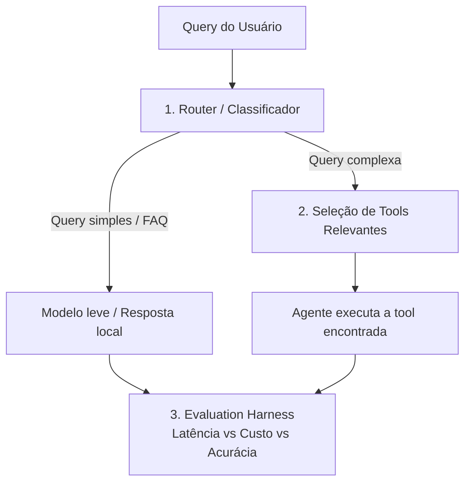

# Case Técnico — Router de Queries & Seleção de Tools

## Contexto

Você está construindo o "cérebro de roteamento" de um agente de atendimento (banco digital
fictício). Antes de qualquer chamada a um LLM caro, o sistema precisa decidir **o caminho mais
barato e rápido possível** para responder cada mensagem do usuário.

Este case tem requisitos claros, mas **a técnica/abordagem é escolha sua** — não há uma única
solução "certa" esperada. Justifique as decisões que tomar.



## O que você precisa implementar

### Pilar 1 — Router (`router.py`)
Um componente que decide, para cada `query`, se ela deve ir para:
- `FAST_PATH`: saudações, FAQ, perguntas genéricas → resposta local (`common/mock_llm.py`).
- `AGENT`: precisa de uma tool específica → vai para o Pilar 2.

Implemente `fit(texts, labels)` e `predict(query) -> RouteResult` (contrato em
`common/interfaces.py`). A técnica é livre. Treine com `data/router_training_data.json`.

### Pilar 2 — Seleção de Tools Relevantes (`retrieval.py`)
O catálogo de tools está em `data/tools_registry.json`. Passar todas as tools no prompt de
um LLM não escala (estoura o contexto, confunde o modelo, aumenta custo e latência).

**Requisito:** `search(query, k=2)` deve retornar as `k` tools mais relevantes do catálogo
para a query, antes de qualquer chamada ao LLM. A estratégia de seleção/ranking é livre —
só precisa ser justificável.

### Pilar 3 — Evaluation Harness (`harness.py`)
A orquestração do pipeline já está pronta. Falta implementar as métricas:
- Acurácia do Router + matriz de confusão.
- Precision@K do retriever (a tool certa estava no top-k?).
- % de economia de custo e de latência do pipeline "inteligente" vs. baseline (mandar tudo
  direto para o LLM caro, com todas as tools no prompt).

## Como rodar

```bash
pip install -r requirements.txt
python -m candidate_starter.run_case
pytest candidate_starter/tests -v
```

## Entregáveis

1. `router.py`, `retrieval.py`, `harness.py` implementados (os testes em `tests/` devem passar).
2. O relatório impresso/gerado por `run_case.py` (salvo em `reports/candidate_report.json`).
3. Um breve comentário (README ou PR) explicando as escolhas técnicas e trade-offs.
