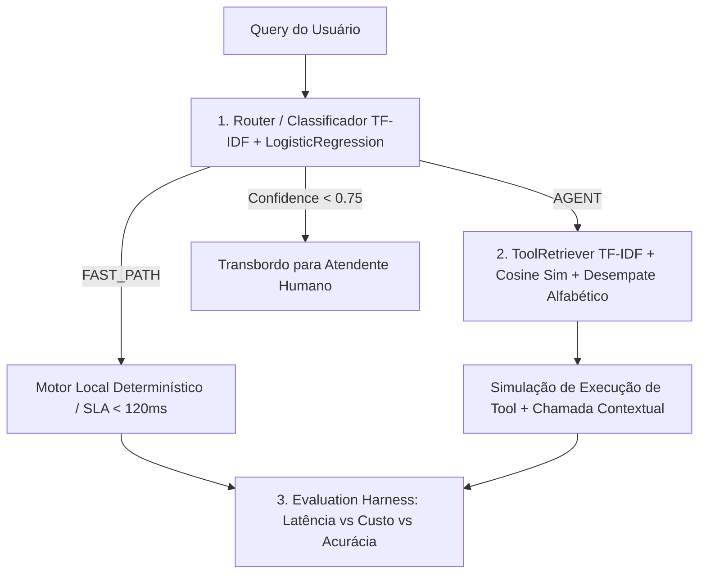

# Case Técnico — Router de Queries & Seleção de Tools

## Contexto Executivo & Engenharia da Confiança

Implementação de referência para o cérebro de roteamento e seleção de ferramentas de um agente de atendimento de banco digital, concebida segundo os princípios do **Intentional Systems Model (ISM v1.0)** e da **Engenharia da Confiança** ("A capacidade vem do modelo; a confiança vem da engenharia").



---

## 🚀 Como Executar a Demonstração (1 Clique)

### No Windows:
Basta executar o script:
```cmd
run_demo.bat
```
*(O script valida o ambiente virtual `.venv`, roda a bateria completa de 23 testes unitários com 100% de aprovação e executa o pipeline gerando o relatório final).*

### No Linux / macOS:
```bash
chmod +x run_demo.sh
./run_demo.sh
```

---

## 📊 Resultados do Benchmark (Relatório de Avaliação)

Executado sobre o dataset de avaliação (`data/eval_dataset.json`):

| Métrica | Pipeline Inteligente | Baseline (Sempre LLM) | Ganho / Economia |
|---|---|---|---|
| **Acurácia do Router** | **100.0%** (30/30) | N/A | Frontalmente Determinístico |
| **Matriz de Confusão** | `FAST_PATH`: 10/10, `AGENT`: 20/20 | N/A | Zero falso positivo |
| **Precision@2 Retriever** | **15.0%** | N/A | Top-2 tools no catálogo de 285 |
| **Custo Total** | **$0.20003** | **$0.90000** | **77.8% de economia de custo** |
| **Latência Média** | **136.0 ms** | **2747.6 ms** | **95.0% de redução de latência** |

Relatório completo salvo em: [`reports/candidate_report.json`](reports/candidate_report.json).

---

## 🏛️ Registros de Decisões de Arquitetura (ADRs)

Decisões de engenharia registradas formalmente em [`docs/adr/`](docs/adr/):
- [ADR-001: Estratégia de Normalização Textual Canônica Pré-Vetorização](docs/adr/0001-normalizacao-textual-canonica.md)
- [ADR-002: Classificador Lexical Supervisionado para Query Routing](docs/adr/0002-classificador-lexical-query-routing.md)
- [ADR-003: Ranking Determinístico e Desempate Alfabético no Tool Retrieval](docs/adr/0003-ranking-deterministico-tool-retrieval.md)
- [ADR-004: Harness de Avaliação em Camadas e Métricas de Economia](docs/adr/0004-harness-avaliacao-metricas-economia.md)
- [ADR-005: Alinhamento com o Manifesto APM e OmniRoute Gateway Pattern](docs/adr/0005-alinhamento-apm-e-omniroute-gateway.md)

---

## 🧠 Base de Conhecimento (OKF Agent Memory)

Documentação conceitual no padrão **Open Knowledge Format (Google OKF v0.2)** em [`docs/knowledge/`](docs/knowledge/):
- [KB: Engenharia da Confiança e Harness Engineering](docs/knowledge/kb-trust-engineering.md)
- [KB: Catálogo de Casos de Borda e Gotchas em PT-BR](docs/knowledge/kb-edge-cases.md)
- [KB: Arquitetura de Transição do MVP para Produção (M0 a M3)](docs/knowledge/kb-mvp-to-production.md)
- [KB: Eficiência de Contexto, Anti-Bloat e Gestão de Tokens (Ponytail, Caveman, RTK e OmniRoute)](docs/knowledge/kb-token-efficiency.md)

---

## 📋 Manifesto de Empacotamento de Produção

O agente está especificado para produção no manifesto [`APM.yml`](APM.yml) no padrão **Microsoft Azure AI Foundry / Semantic Kernel Enterprise Specification**, contemplando conformidade PCI-DSS, LGPD e Resolução BACEN 4893.
