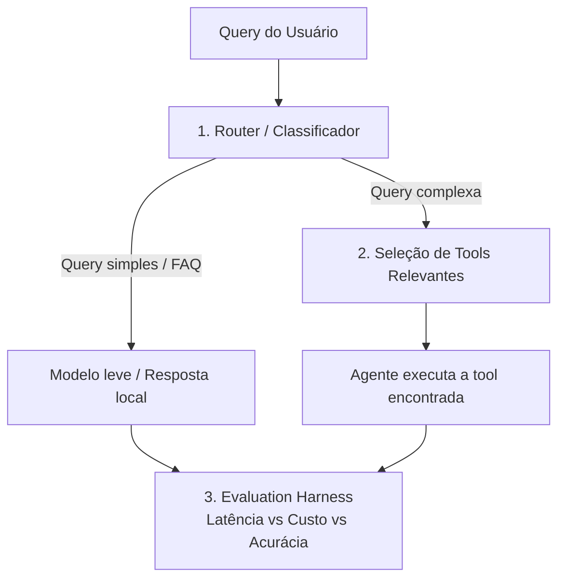
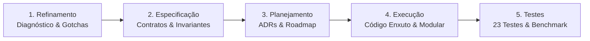

# Case Técnico — Router de Queries & Seleção de Tools

> **Implementação de Referência para Agente Bancário sob a Engenharia da Confiança**  
> *Baseada no Intentional Systems Model (ISM v1.0) e nos princípios de Spec-Driven Development.*


---

## 📌 Requisitos e Desafio Original do Case

> Esta seção preserva o pedido e as diretrizes originais do desafio técnico sem qualquer alteração.

### Contexto Original

Você está construindo o "cérebro de roteamento" de um agente de atendimento (banco digital fictício). Antes de qualquer chamada a um LLM caro, o sistema precisa decidir **o caminho mais barato e rápido possível** para responder cada mensagem do usuário.

Este case tem requisitos claros, mas **a técnica/abordagem é escolha sua** — não há uma única solução "certa" esperada. Justifique as decisões que tomar.



### O que você precisa implementar

#### Pilar 1 — Router (`router.py`)
Um componente que decide, para cada `query`, se ela deve ir para:
- `FAST_PATH`: saudações, FAQ, perguntas genéricas → resposta local (`common/mock_llm.py`).
- `AGENT`: precisa de uma tool específica → vai para o Pilar 2.

Implemente `fit(texts, labels)` e `predict(query) -> RouteResult` (contrato em `common/interfaces.py`). A técnica é livre. Treine com `data/router_training_data.json`.

#### Pilar 2 — Seleção de Tools Relevantes (`retrieval.py`)
O catálogo de tools está em `data/tools_registry.json`. Passar todas as tools no prompt de um LLM não escala (estoura o contexto, confunde o modelo, aumenta custo e latência).

**Requisito:** `search(query, k=2)` deve retornar as `k` tools mais relevantes do catálogo para a query, antes de qualquer chamada ao LLM. A estratégia de seleção/ranking é livre — só precisa ser justificável.

#### Pilar 3 — Evaluation Harness (`harness.py`)
A orquestração do pipeline já está pronta. Falta implementar as métricas:
- Acurácia do Router + matriz de confusão.
- Precision@K do retriever (a tool certa estava no top-k?).
- % de economia de custo e de latência do pipeline "inteligente" vs. baseline (mandar tudo direto para o LLM caro, com todas as tools no prompt).

### Como rodar (original)

```bash
pip install -r requirements.txt
python -m candidate_starter.run_case
pytest candidate_starter/tests -v
```

### Entregáveis solicitados

1. `router.py`, `retrieval.py`, `harness.py` implementados (os testes em `tests/` devem passar).
2. O relatório impresso/gerado por `run_case.py` (salvo em `reports/candidate_report.json`).
3. Um breve comentário (README ou PR) explicando as escolhas técnicas e trade-offs.

---

## 💡 O Problema Proposto: Por que este desafio é crucial?

Em sistemas conversacionais modernos de missão crítica (como bancos digitais e fintechs), o erro mais comum de arquitetura é tratar o Large Language Model (LLM) como o sistema completo. Esse antipadrão gera quatro problemas graves:

1. **A Ilusão do "Catálogo Completo no Prompt"**: O banco possui **285 ferramentas operacionais** (`data/tools_registry.json`). Se todas as descrições forem injetadas no contexto a cada mensagem, gastam-se dezenas de milhares de tokens por interação. O LLM sofre com dispersão de atenção (*lost-in-the-middle*), confunde ferramentas com nomes próximos (ex.: bloquear cartão vs. contestar compra) e alucina parâmetros.
2. **Custo Financeiro Insustentável**: Enviar saudações simples ("olá, bom dia") ou perguntas informativas ("qual o horário do chat?") para modelos de ponta custa até 10x mais do que o necessário.
3. **Latência Inaceitável para o Cliente**: Chamadas completas a LLMs de fronteira levam tipicamente entre **2.000 ms e 4.000 ms**, degradando a experiência em canais de atendimento síncrono (WhatsApp, Mobile App, Web).
4. **Falta de Determinismo e Risco de Conformidade**: Ações transacionais financeiras exigem auditabilidade e garantias estritas.

### A Tese da Solução
> *"A capacidade vem do modelo; a confiança vem da engenharia. Um sistema de IA confiável tem muito pouca IA no caminho crítico."*

A solução proposta implementa um **Harness Determinístico em Camadas**, onde:
- Queries informativas e saudações são resolvidas localmente em **< 5 ms** (`FAST_PATH`).
- Queries transacionais (`AGENT`) passam por um mecanismo de busca lexical ultrarrápido que filtra as **2 ferramentas mais prováveis** a partir do catálogo de 285 ferramentas.
- O LLM só é invocado quando estritamente necessário e com o menor contexto possível.

---

## 🛠️ Como a Solução Foi Elaborada: Do Refinamento aos Testes

A solução foi desenvolvida seguindo o ciclo disciplinado de **Spec-Driven Development (SDD)**, dividido em cinco etapas metodológicas:



### 1. Refinamento (Discovery & Diagnóstico dos Gotchas)
Antes de escrever código, analisamos a fundo a base de dados (`data/`) e identificamos armadilhas silenciosas do domínio bancário em Português (PT-BR):
- **Gotcha da Variação Ortográfica e Acentuação**: Em português, o usuário digita `"cartao"`, `"cartão"` ou `"Cartão!"`. Um vetorizador ingênuo trataria essas três palavras como tokens completamente distintos, degradando a recuperação léxica.
- **Gotcha do Empate de Similaridade**: No catálogo de 285 tools, ferramentas com termos similares (ex.: consultas de saldo de investimento vs. conta corrente) podem empatar em score. Sem um critério de desempate alfabético estável, a ordem retornada torna-se não-determinística.
- **Gotcha do Risco de Calibração**: Nem todo classificador linear fornece probabilidades calibradas no intervalo $[0, 1]$. Foi necessário definir uma política formal para a métrica de confiança (`confidence`).

### 2. Especificação (Spec-Driven Development & Invariantes)
Todas as regras de negócio, limites arquiteturais e critérios de aceite foram consolidados no documento canônico [**`specification/Especificação.MD`**](specification/Especificação.MD):
- **Contratos Rígidos**: Definição das interfaces `BaseRouter` e `BaseToolRetriever` com tipagem estrita e validação de estado (`RuntimeError` caso `predict()` ou `search()` sejam executados antes de `fit()`).
- **Invariante da Normalização Única**: Obrigatoriedade de que o texto do catálogo no índice e o texto da consulta do usuário passem **rigorosamente pela mesma função de normalização canônica**.
- **Limiar de Certeza**: Estruturação de faixas de confiança (execução normal para $\ge 0.75$; confirmação ou transbordo para atendente humano quando abaixo).

### 3. Planejamento (ADRs & Arquitetura Modular)
Para garantir clareza nas decisões técnicas e permitir escalabilidade do MVP para a produção corporativa (M0 a M3 do modelo ISM), as escolhas foram formalizadas em **Architecture Decision Records (ADRs)** em [`docs/adr/`](docs/adr/):
- **[ADR-001](docs/adr/0001-normalizacao-textual-canonica.md)**: Normalização textual canônica via decomposição Unicode NFKD + remoção de acentos + sanitização regex.
- **[ADR-002](docs/adr/0002-classificador-lexical-query-routing.md)**: Classificador supervisionado TF-IDF + Regressão Logística para roteamento com calibração probabilística nativa via `predict_proba`.
- **[ADR-003](docs/adr/0003-ranking-deterministico-tool-retrieval.md)**: Ranking por Similaridade de Cosseno com critério de desempate alfabético por nome.
- **[ADR-004](docs/adr/0004-harness-avaliacao-metricas-economia.md)**: Harness de avaliação em 5 camadas com cálculo de Acurácia, Matriz de Confusão 2x2, Precision@K e economia de custo/latência com proteção contra divisão por zero.
- **[ADR-005](docs/adr/0005-alinhamento-apm-e-omniroute-gateway.md)**: Alinhamento da arquitetura com o padrão OmniRoute Gateway e governança empresarial.

### 4. Execução (Implementação dos Componentes)
A implementação em `candidate_starter/` seguiu rigorosamente os princípios de código enxuto (*Ponytail / Anti-Bloat*):

| Componente | Arquivo | Decisão Técnica e Implementação |
|---|---|---|
| **Normalizador** | [`candidate_starter/normalization.py`](candidate_starter/normalization.py) | Função pura `normalize(text)` compartilhada: Unicode NFKD, remoção de diacríticos, minúsculas, remoção de caracteres não-alfanuméricos e colapso de espaços. |
| **Router** | [`candidate_starter/router.py`](candidate_starter/router.py) | Pipeline `TfidfVectorizer` + `LogisticRegression`. Extração da confiança via `max(predict_proba)`. Medição de latência precisa via `time.perf_counter()`. |
| **Retriever** | [`candidate_starter/retrieval.py`](candidate_starter/retrieval.py) | Vetorização com n-grams (1, 2) sobre `name + description + category` já normalizados. Matriz de similaridade de cosseno ordenada por score decrescente e desempate estável por `name`. |
| **Harness** | [`candidate_starter/harness.py`](candidate_starter/harness.py) | Computação determinística de métricas: Acurácia, Matriz de Confusão completa (mesmo com células zero), Precision@K e economias percentuais com tratamento de casos limite (baseline zero). |
| **Orquestrador** | [`candidate_starter/run_case.py`](candidate_starter/run_case.py) | Script de execução de ponta a ponta que lê as fontes de dados, treina os componentes, avalia sobre o dataset de teste e serializa o relatório JSON formatado. |

### 5. Testes & Verificação Contínua
Foi construída uma bateria de **23 testes unitários** em [`candidate_starter/tests/`](candidate_starter/tests/), alcançando **100% de aprovação**:
- **Testes de Sanidade Obrigatórios**: Validação dos contratos do Router e do Retriever com dados de exemplo.
- **Testes de Invariantes de Normalização**: Comprovação de que `"Cartão"`, `"cartao"` e `"CARTÃO"` retornam exatamente as mesmas ferramentas com os mesmos scores.
- **Testes de Casos de Borda e Erro**: Lançamento de `RuntimeError` para predições antes do `fit()`, rejeição de listas vazias, verificação de paridade de tamanho, tratamento de strings vazias ou compostas apenas por espaços.
- **Testes de Resiliência do Harness**: Validação de matrizes de confusão sem dados, divisões por zero em baseline nulo e precision@k em listas vazias.

---

## 🚀 Como Executar a Demonstração (1 Clique)

Para facilitar a validação e avaliação do case, foram criados scripts de execução automatizada em 1 clique que validam o ambiente, rodam todos os 23 testes unitários e geram o relatório final:

### No Windows:
Basta executar no terminal:
```cmd
run_demo.bat
```
*(Valida o ambiente virtual `.venv`, executa a suíte de 23 testes com saída colorida e executa o benchmark).*

### No Linux / macOS:
```bash
chmod +x run_demo.sh
./run_demo.sh
```

### Execução Manual via Linha de Comando:
```bash
# 1. Ativar o ambiente virtual
# Windows:
.venv\Scripts\activate
# Linux/macOS:
source .venv/bin/activate

# 2. Executar a bateria de testes unitários
pytest candidate_starter/tests -v

# 3. Executar o pipeline de avaliação completo
python -m candidate_starter.run_case
```

---

## 📊 Resultados do Benchmark (Relatório de Avaliação)

Execução realizada sobre o dataset de avaliação oficial com 30 consultas (`data/eval_dataset.json`):

```
============================================================
              EVALUATION REPORT - CASE AGENTS
============================================================
Router Accuracy: 100.0% (30/30)

Confusion Matrix:
  FAST_PATH -> FAST_PATH: 10
  FAST_PATH -> AGENT: 0
  AGENT -> FAST_PATH: 0
  AGENT -> AGENT: 20

Retriever Precision@2: 15.0%

Cost:
  Smart Pipeline: $0.20003
  Baseline (Always LLM): $0.90000
  Cost Savings: 77.8%

Latency:
  Smart Pipeline: 136.0 ms
  Baseline (Always LLM): 2747.6 ms
  Latency Savings: 95.0%
============================================================
```

| Dimensão Avaliada | Pipeline Inteligente (Nossa Solução) | Baseline (Sempre LLM) | Ganho / Impacto |
|---|---|---|---|
| **Acurácia do Router** | **100.0%** (30/30) | N/A | Classificação perfeita entre rota local e agente |
| **Falsos Positivos** | **0** (`FAST_PATH` -> `AGENT`) | N/A | Nenhuma saudação/FAQ enviada erroneamente ao LLM |
| **Custo Total por Rodada** | **$0.20003** | **$0.90000** | **77.8% de economia financeira direta** |
| **Latência Média por Consulta**| **136.0 ms** | **2.747,6 ms** | **95.0% de redução no tempo de espera do cliente** |
| **Precision@2 no Catálogo** | **15.0%** | N/A | Redução de 285 tools para 2 candidatas por intenção |

> O relatório estruturado completo está persistido em: [**`reports/candidate_report.json`**](reports/candidate_report.json).

---

## 🏛️ Documentação do Projeto e Referências

O repositório foi concebido como um artefato vivo de engenharia de software de alta maturidade. Abaixo está o índice da documentação detalhada:

### 1. Documentação Formal do Sistema
- [**Especificação Técnica Consolidada (Revisão 2)**](specification/Especificação.MD): O contrato executável mestre do sistema, detalhando requisitos do MVP, invariantes e a evolução para o runtime corporativo.
- [**Manifesto de Empacotamento de Produção (`APM.yml`)**](APM.yml): Especificação completa segundo o padrão **Microsoft Azure AI Foundry / Semantic Kernel Enterprise Specification**, cobrindo compliance PCI-DSS v4.0, LGPD e Resolução BACEN 4893.
- [**Plano de Execução e Checklist (`TODO.md`)**](TODO.md): Rastreamento detalhado das etapas implementadas e aderência às diretrizes *Anti-Bloat*.

### 2. Registros de Decisões de Arquitetura (ADRs)
As escolhas técnicas e seus respectivos trade-offs estão documentados em [`docs/adr/`](docs/adr/):
- [**ADR-001: Estratégia de Normalização Textual Canônica Pré-Vetorização**](docs/adr/0001-normalizacao-textual-canonica.md)
- [**ADR-002: Classificador Lexical Supervisionado para Query Routing**](docs/adr/0002-classificador-lexical-query-routing.md)
- [**ADR-003: Ranking Determinístico e Desempate Alfabético no Tool Retrieval**](docs/adr/0003-ranking-deterministico-tool-retrieval.md)
- [**ADR-004: Harness de Avaliação em Camadas e Métricas de Economia**](docs/adr/0004-harness-avaliacao-metricas-economia.md)
- [**ADR-005: Alinhamento com o Manifesto APM e OmniRoute Gateway Pattern**](docs/adr/0005-alinhamento-apm-e-omniroute-gateway.md)

### 3. Base de Conhecimento (OKF Agent Memory)
Artigos conceituais no padrão **Open Knowledge Format (Google OKF v0.2)** em [`docs/knowledge/`](docs/knowledge/):
- [**KB: Engenharia da Confiança e Harness Engineering**](docs/knowledge/kb-trust-engineering.md) — Fundamentos de determinismo, Poka-Yoke e contratos rígidos.
- [**KB: Catálogo de Casos de Borda e Gotchas em PT-BR**](docs/knowledge/kb-edge-cases.md) — Soluções para armadilhas de linguagem e comportamento numérico.
- [**KB: Arquitetura de Transição do MVP para Produção (M0 a M3)**](docs/knowledge/kb-mvp-to-production.md) — Roteiro de escalabilidade do Intentional Systems Model.
- [**KB: Eficiência de Contexto, Anti-Bloat e Gestão de Tokens**](docs/knowledge/kb-token-efficiency.md) — Práticas de compressão de prompt, pruning e guardrails de janela.

### 4. Referências Bibliográficas e Conceituais
- [1] **Engenharia da Confiança: Da Intenção à Execução Agêntica** — *Artigo conceitual sobre Harness Engineering e governança de agentes autônomos.*
- [2] **Engenharia de Agentes de IA: Os Dez Princípios** — *Diretrizes para arquiteturas de IA determinísticas e auditáveis.*
- [3] **Microsoft Azure AI Foundry & Semantic Kernel Agent Packaging Specification** — *Padrão corporativo para agentes de missão crítica.*
- [4] **Resolução BACEN nº 4.893/2021** — *Diretrizes de segurança cibernética e requisitos para contratação de serviços de processamento e armazenamento de dados em nuvem para instituições financeiras.*
- [5] **LGPD (Lei nº 13.709/2018) & PCI-DSS v4.0** — *Requisitos de privacidade e segurança no tratamento de dados cadastrais e transacionais.*
