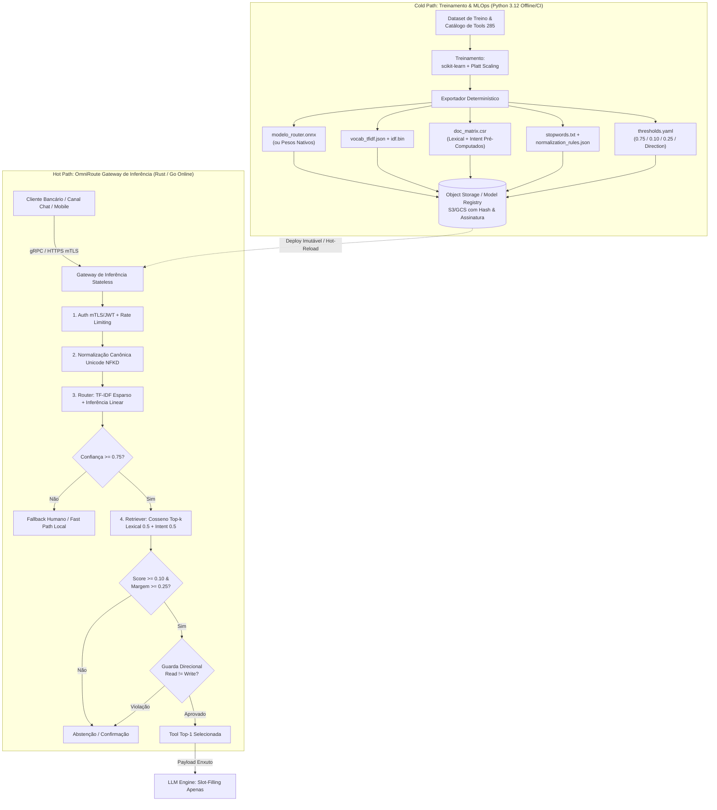

# Proposta de Arquitetura Multi-Linguagem: Tool Routing & Retrieval de Alta Performance

> **Documento de Arquitetura de Referência (RFC / Whitepaper Técnico)**  
> **Status:** Aprovado para Engenharia  
> **Domínio:** Agentes Bancários de Missão Crítica / Gateway de Inferência  
> **Data:** 2026-09-11  
> **Alinhamento:** ISM v1.0 (M2 · Arquitetar & M3 · Orquestrar), APM.yml, ADR-005, ADR-009  

---

## 1. Visão Geral da Arquitetura

A arquitetura separa rigidamente **Pesquisa/Treinamento** (Python, offline ou batch) de **Inferência/Gateway** (linguagem de sistemas, online). O objetivo é garantir **latência p99 previsível (< 1–3 ms)** sob milhares de Requisições por Segundo (RPS), com isolamento estrito de falhas, **zero dependência de runtime Python em produção** e controle total sobre memória e concorrência.



### Componentes Principais

- **Gateway de Inferência (Hot Path)**: Ponto de entrada único. Recebe a query do usuário (via gRPC ou HTTP/2), valida autenticação (mTLS/JWT), aplica normalização canônica, executa o Router + Retriever + Guard Rails inteiramente em memória e devolve a tool selecionada ou aciona o bloqueio de segurança. É stateless e horizontalmente escalável.
- **API de Inferência / Motor Core**: Biblioteca embutida (*in-process*) no Gateway (ou sidecar de altíssima velocidade). Contém o modelo linear exportado, o vetorizador TF-IDF serializado e a lógica de similaridade vetorial + guard rails. Tudo é processado localmente na memória do processo, eliminando saltos de IPC ou RPCs desnecessários.
- **Pipeline de Treinamento (Cold Path)**: Ambiente Python gerenciado (`scikit-learn` + `CalibratedClassifierCV`). Treina, calibra via Platt Scaling, valida contra o dataset de avaliação e exporta artefatos imutáveis e versionados.
- **Artefatos Versionados**: Grafo ONNX (ou matrizes de pesos nativos), vocabulário TF-IDF com pesos IDF, matriz esparsa CSR dos documentos do catálogo pré-computada, stopwords canônicas e regras de normalização compiladas. Todos publicados em storage de objetos com hash criptográfico SHA-256.
- **Config / Feature Flags + Guard Rails Runtime**: Limiares operacionais (`confidence >= 0.75`, `min_score >= 0.10`, `relative_margin >= 0.25`) e metadados direcionais carregados dinamicamente via hot-reload ou ConfigMap, sem necessidade de recompilar o binário.
- **Observabilidade**: Métricas estruturadas de latência por estágio (normalização, embedding, score, guard rails), histogramas p50/p90/p99/p99.9, contadores de bloqueios por tipo de guarda e tracing distribuído via OpenTelemetry (sem dados sensíveis PII).

> **Princípio Chave:** Não há orquestradores pesados (LangChain, LlamaIndex, etc.) no hot path. O caminho de execução é um pipeline linear e determinístico de funções puras em memória.

---

## 2. Escolha da Stack Tecnológica

### Gateway / Motor de Inferência: Rust (Recomendado Primário) ou Go

| Critério de Avaliação | **Rust** (Recomendado Primário) | **Go** (Alternativa Secundária) |
|---|---|---|
| **Gerenciamento de Memória** | **Zero GC** (Ownership & Borrow Checker). Sem pausas imprevisíveis. | Garbage Collector com pausas sub-milissegundos, mas com risco de jitter sob carga extrema de strings. |
| **Latência p99** | **Sub-milissegundo (< 1 ms)** determinística e previsível. | 2 ms a 5 ms (pequenas oscilações durante coletas do GC). |
| **Concorrência** | `tokio` (I/O assíncrono não-bloqueante) + `rayon` (paralelismo de dados/álgebra linear). | Goroutines nativas e canais. Excelente concorrência I/O, menor controle de cache de CPU. |
| **Operações de Texto & NLP** | Crates maduros: `unicode-normalization`, `regex` (DFA com garantia linear), `tokenizers`. | Pacote `strings`, `regexp` (mais lento que regex em C/Rust) ou wrappers CGo. |
| **Álgebra Linear & ONNX** | `ort` (bindings oficiais ONNX Runtime de zero-overhead), `ndarray`, `sprs` (matrizes esparsas). | `onnxruntime-go` via CGo (custo de troca de contexto Go ↔ C). |
| **Segurança e Conformidade** | Prevenção formal de data races, buffer overflows e vazamento de memória (Memory Safety nativa). | Memory safe, porém com risco de alocações excessivas gerando pressão no heap. |
| **Artefato de Entrega** | Binário estático único (~15-25 MB), container `scratch` ou `distroless`. | Binário estático único (~20-30 MB), container `distroless`. |

#### Racional para a Escolha de Rust
1. **Controle Fino de Alocação**: Possibilidade de alocar *buffers* estáticos no startup e utilizar *arena allocators* ou *object pools*, garantindo **zero alocações dinâmicas no heap durante a requisição**.
2. **Segurança Bancária**: Impossibilidade de *data races* em concorrência pesada de leitura no catálogo de 285 ferramentas compartilhado entre centenas de threads.
3. **Ausência do GIL**: Paralelismo real em todos os núcleos de CPU disponíveis, sem overhead de processos separados.

#### Quando Considerar Go?
Go é a alternativa preferível se a equipe de engenharia já possuir maior senioridade no ecossistema Go e o SLA p99 tolerar variações na faixa de 3 a 8 ms. Exige disciplina estrita de pooling (`sync.Pool`) para reutilização de buffers de normalização de strings.

### O Papel de Python: Restrito ao Ciclo de Vida Offline

O runtime de produção **nunca importa Python, numpy ou scikit-learn**. O ecossistema Python é mantido onde ele é imbatível:
- Engenharia de features, experimentação e calibração de modelos (`CalibratedClassifierCV`).
- Geração de datasets sintéticos e testes adversariais de robustez.
- Scripts de validação offline, cálculo de SHAP values e detecção de drift semântico.
- Exportação automatizada de artefatos no pipeline de CI/CD.

---

## 3. Portabilidade do Modelo: O Gargalo Matemático

O classificador de roteamento é linear (`LogisticRegression` com calibração Platt via Sigmoid). A linearidade é o ativo mais valioso para a portabilidade entre plataformas.

### Pipeline de Exportação e Serialização

```
1. Treinamento Python (scikit-learn)
   TfidfVectorizer(ngram_range=(1,2), sublinear_tf=True)
   CalibratedClassifierCV(estimator=LogisticRegression(), method="sigmoid", cv="prefit")
       │
       ├──> Exportação ONNX: skl2onnx gera grafo com TF-IDF + Sigmoid
       │
       └──> Exportação Nativa (Zero-Dependency):
            ├── vocabulary.json : {"token": index}
            ├── idf.bin         : [f32; vocab_size]
            ├── weights.bin     : [f32; num_classes * vocab_size]
            └── platt_params.json: { "A": [f32], "B": [f32] }
```

### Duas Estratégias de Execução no Runtime

1. **Estratégia A: ONNX Runtime (`ort` crate)**
   - **Vantagem**: Reduz o risco de divergência matemática entre Python e Rust a zero no dia zero.
   - **Mecanismo**: Carrega o arquivo `.onnx` via ONNX Runtime C API.
   - **Recomendação**: Ponto de partida padrão para entrada rápida em produção.

2. **Estratégia B: Reimplementação Nativa em Rust (Zero External Deps)**
   - **Vantagem**: Elimina a dependência de bibliotecas dinâmicas C++ (`onnxruntime.so`/`.dll`). Latência de inferência cai para **< 50 microsegundos**.
   - **Mecanismo**: Como o modelo é um produto escalar entre um vetor esparso TF-IDF e um vetor de pesos densos seguido pela aplicação da função logística calibrada:
     $$\hat{P}(y = 1 | x) = \frac{1}{1 + \exp(A \cdot (w^T x + b) + B)}$$
   - O vocabulário é mantido em uma tabela de busca de alta eficiência (*Perfect Hash* com crate `phf` ou `hashbrown::HashMap`).

### Pré-computação da Matriz de Documentos do Retriever

O Retriever não necessita de redes neurais nem de treinamento em GPU. Ele opera sobre **Similaridade de Cosseno Combinada** (Lexical + Intent/Glossário):
- Durante o pipeline de CI/CD, os 285 documentos do catálogo de ferramentas são vetorizados com o vocabulário TF-IDF congelado.
- Os vetores unitários resultantes ($\|d\|_2 = 1.0$) são salvos como matriz esparsa CSR (*Compressed Sparse Row*) ou densa contígua.
- Em runtime, o cálculo do cosseno contra a query vetorizada $q$ se reduz a uma simples multiplicação matriz-vetor esparsa:
  $$\text{score}(q, d) = q^T \cdot d$$

---

## 4. Replicação Determinística da Lógica NLP em Rust

Para que a inferência em Rust produza resultados idênticos aos do Python (tolerância $\epsilon < 10^{-6}$), cada etapa de pré-processamento deve ser rigorosamente espelhada:

```rust
// Exemplo de Estrutura do Hot Path em Rust (Zero-Allocation)
pub struct FastPipeline {
    vocab: HashMap<String, u32>,
    idf: Vec<f32>,
    doc_matrix_lexical: CsMat<f32>,   // Matriz CSR de documentos
    doc_matrix_intent: CsMat<f32>,    // Matriz CSR de glossários
    router_weights: Vec<f32>,         // Pesos do modelo linear
    platt_a: f32,
    platt_b: f32,
}

impl FastPipeline {
    pub fn infer(&self, raw_query: &str, ctx: &mut RequestContext) -> RouteDecision {
        // 1. Normalização in-place no buffer de requisição
        let normalized = ctx.normalize(raw_query);
        
        // 2. Tokenização de unigramas e bigramas
        let tokens = ctx.tokenize_ngrams(normalized);
        
        // 3. Projeção no vocabulário esparso TF-IDF
        let query_vec = ctx.vectorize_tfidf(&tokens, &self.vocab, &self.idf);
        
        // 4. Inferência do Router (Dot Product + Platt Sigmoid)
        let conf = self.predict_router_confidence(&query_vec);
        if conf < 0.75 {
            return RouteDecision::FallbackHuman { conf };
        }
        
        // 5. Retriever: Cosseno combinado sobre matrizes pré-carregadas
        let (top1, top2) = self.retrieve_top2(&query_vec, ctx.is_read_intent());
        
        // 6. Guard Rails de Relevância e Margem
        if top1.score < 0.10 {
            return RouteDecision::AbstainLowScore { score: top1.score };
        }
        if (top1.score - top2.score) / top1.score < 0.25 {
            return RouteDecision::ConfirmAmbiguity { top1, top2 };
        }
        
        RouteDecision::ExecuteTool(top1.tool_id)
    }
}
```

### Detalhes de Implementação dos Estágios:
1. **Normalização Canônica**: `unicode-normalization` (decomposição NFKD) + remoção de diacríticos (tabela estática ASCII) + lowercase ASCII + regex compilado estaticamente via `lazy_static!` ou `once_cell`.
2. **Tokenização**: Divisão por espaços e pontuação (`\b`), geração de bigramas contíguos no mesmo buffer de iteração sem alocar novas Strings no heap.
3. **Vetorização**: Contagem de termos com cálculo sublinear de frequência ($1 + \ln(\text{tf})$), multiplicação pelos pesos pré-computados de $\text{idf}$ e normalização Euclidiana L2 do vetor final.
4. **Ranking com Min-Heap**: Os scores de similaridade são avaliados em passagem única, mantendo apenas os $k=2$ maiores scores em uma estrutura de tamanho fixo em *stack memory*, evitando ordenações desnecessárias do array de 285 itens.

---

## 5. Fluxo de Dados de uma Requisição (Data Flow)

O ciclo de vida completo de uma mensagem no Gateway de Inferência compreende 10 etapas sequenciais:

```
[Cliente / App Bancário]
       │
       ▼ (1) gRPC / HTTPS Request { query: "qual o saldo da minha conta?" }
[Gateway de Inferência]
       │
       ├── (2) Autenticação mTLS / JWT Bancário + Validação de Schema + Rate Limiter
       ├── (3) Normalização determinística da string (remoção de acentos, pontuação, lowercase)
       ├── (4) Transformação TF-IDF esparsa da query usando vocabulário estático em memória
       ├── (5) Router: Projeção linear + Calibração Platt Sigmoid -> Confiança = 0.94
       ├── (6) Guard Rail 1: Confiança >= 0.75? (0.94 >= 0.75 -> Aprovado para Rota AGENT)
       ├── (7) Retriever: Dot product contra matrizes de 285 ferramentas (0.5*Lexical + 0.5*Intent)
       │       - Top-1: consultar_saldo (Score: 0.582)
       │       - Top-2: consultar_extrato (Score: 0.310)
       ├── (8) Guard Rails 2, 3 e 4:
       │       - Score Top-1 >= 0.10? (0.582 >= 0.10 -> OK)
       │       - Margem Relativa >= 0.25? ((0.582 - 0.310) / 0.582 = 0.467 >= 0.25 -> OK)
       │       - Guarda Direcional: Query é leitura ("qual") e Tool é leitura (READ) -> OK
       ├── (9) Montagem do Payload de Decisão: { tool_id: "consultar_saldo", confidence: 0.94, ... }
       │
       ▼ (10) Resposta de Baixa Latência (< 2ms p99) para orquestração / Slot-filling
[Cliente / Motor de Diálogo]
```

**Tempo total gasto nos passos 3 a 8 em hardware moderno:** **entre 0.4 ms e 1.5 ms**.

---

## 6. Integração e Deploy Contínuo (MLOps)

### Pipeline de CI/CD Automatizado

```
[Git Push no Repositório]
       │
       ├── 1. Treinamento & Validação (Python 3.12)
       │      - Executa treinamento do TfidfVectorizer e CalibratedClassifierCV
       │      - Executa suíte de avaliação sobre eval_dataset.json (Quality Gate: 100% acurácia)
       │
       ├── 2. Geração & Empacotamento de Artefatos
       │      - Exporta model.onnx (ou pesos nativos), vocab.json, idf.bin
       │      - Compila doc_matrix.csr (matrizes de documentos pré-vetorizados)
       │      - Gera manifesto de hashes SHA-256 e assinatura digital
       │
       ├── 3. Testes de Paridade (Golden File Testing)
       │      - Executa 1.000 queries sintéticas em Python e no binário compilado Rust
       │      - Verifica se |Score_Python - Score_Rust| < 1e-5 para todos os outputs
       │
       ├── 4. Publicação no Registry
       │      - Upload dos artefatos versionados no Object Storage (S3 / GCS / Azure Blob)
       │
       └── 5. Deploy Zero-Downtime (Kubernetes)
              - Rollout Canary / Blue-Green dos pods do Gateway
              - Health check valida carregamento da matriz em memória e roda smoke test
```

### Governança e Atualização Sem Retreino
- **Atualização de Metadados do Catálogo**: Alterações em descrições, glossários ou modos de direção (Read/Write) de ferramentas não exigem retreinar o Router. O pipeline reconstrói apenas `doc_matrix.csr` e `taxonomy.json` em segundos, e o Gateway atualiza o estado em memória via *hot-reload* seguro com `ArcSwap` (Atomic Pointer Swap em Rust).
- **Detecção de Drift em Produção**: Amostras anonimizadas de queries reais são coletadas de forma assíncrona (via Kafka/Kinesis) e reavaliadas semanalmente no ambiente offline em Python para monitorar calibração de probabilidades e novas gírias/jargões de clientes.

---

## 7. Comparativo de Eficiência e Segurança Operacional

| Dimensão | Arquitetura MVP Original (Python Monolítico) | Nova Arquitetura Proposta (Rust Gateway + Cold Python) |
|---|---|---|
| **Latência Média** | ~200 ms (com picos de 400 ms sob concorrência) | **< 1.5 ms (p99 previsível)** |
| **Consumo de Memória por Pod** | 800 MB – 1.5 GB (processos múltiplos Uvicorn) | **< 30 MB (processo único estático)** |
| **Capacidade de Throughput** | ~150 RPS por núcleo de CPU | **> 12.000 RPS por núcleo de CPU** |
| **Isolamento de Falhas** | Risco de crash de worker por exceções não tratadas | **Falha impossível no hot path** (tipagem estrita / Result types) |
| **Surface de Segurança** | Vulnerabilidades em dependências Python (PyPI) | **Binário estático sem runtime**, container `distroless` |
| **Governança Regulatória** | Logs sujeitos a vazamento de PII | **Sem PII**: normalização e roteamento ocorrem sem persistir texto |

---

## 8. Considerações Finais e Próximos Passos

A arquitetura proposta consagra a transição do modelo experimental para uma infraestrutura bancária de classe mundial:
1. **Preserva 100% da inteligência algorítmica** desenvolvida e validada no MVP (Router linear calibrado + BM25F multi-campo + 4 camadas de Guard Rails).
2. **Elimina completamente o gargalo do GIL** e o desperdício computacional de manter runtimes Python servindo tráfego online.
3. **Fornece escalabilidade linear e previsibilidade absoluta**, essenciais para operações financeiras reguladas pelo BACEN e sujeitas a picos súbitos de volumetria (como datas de vencimento de faturas e Black Friday).
